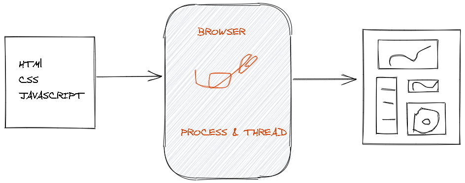
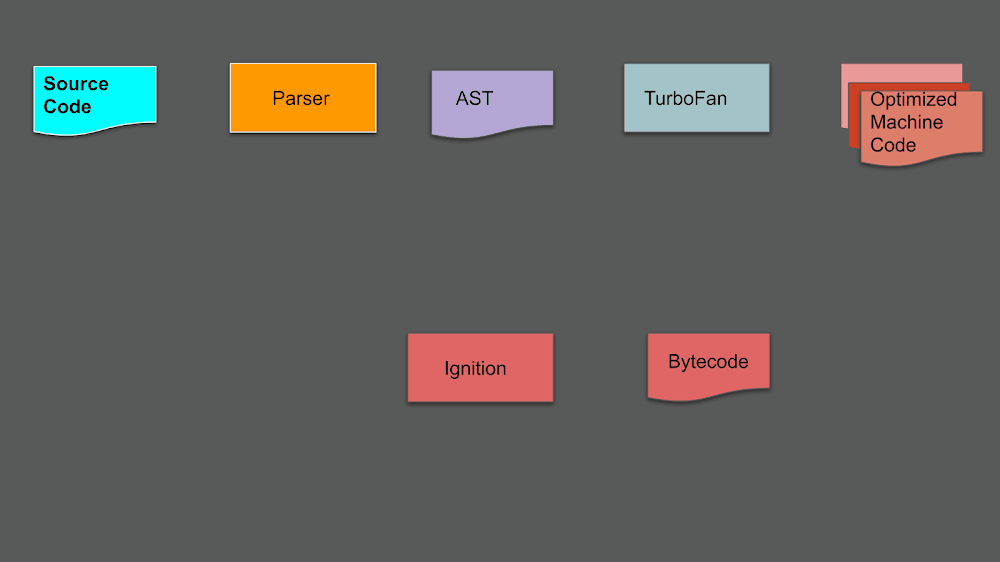

### HOW JavaScript engines (CHROME V8) WORKS

------------------------------

The web browser are the main part of internet world.When ever we type  a  URL in the address bar, it fetch resources from remote server, and display them on the screen, through this time it mainly undergoes 3 process

- Fetch
- Process
- Display

At first it fetching data from subsequent web servers via the internet. Then the `Render engine`, will process the received recourses. After that  the `Browser Engine` will performs data presentation. so how all this happen...?

To know better about these processes, we should know the javascript engines. A **JavaScript engine** is a program or an interpreter which executes JavaScript code. A JavaScript engine can be implemented as a standard interpreter, or just-in-time compiler that compiles JavaScript to bytecode in some form . see the high level overview of the js engine in below image

1. **Parser**
The Html Parser will fetch all scripts loaded via `<script>` tag. The source code inside this script gets loaded as a UTF-16 byte stream to a byte stream decoder. This byte stream decoder then decodes the bytes into token and  then its sent to parser.
2. **AST(Abstract Syntax Tree)**
The parser creates nodes based on the tokens it gets. With these nodes, it creates an Abstract Syntax Tree (AST).

3. **Interpreter**
The interpreter walks through the AST and generates byte code. It reads the code line by line. When the byte code has been generated, the AST is deleted for clearing up memory space.

4. **Profiler**
The Profiler monitors and watches code to optimize it.
5. **Compiler**
The compiler works ahead of time and creates a translation of the code that has been written and compiles down to a lower level language that machines can read.

Different *JavaScript engines*

- V8 — open source, developed by Google, written in C++
- Rhino — managed by the Mozilla Foundation, open source, developed entirely in Java
- SpiderMonkey — the first JavaScript engine, which back in the days powered Netscape Navigator, and today powers Firefox
- JavaScriptCore — open source, marketed as Nitro and developed by Apple for Safari
- KJS — KDE’s engine originally developed by Harri Porten for the KDE project’s Konqueror web browser
- Chakra (JScript9) — Internet Explorer
- Chakra Core(JavaScript) — Microsoft Edge (Now uses v8)
- Nashorn, open source as part of OpenJDK, written by Oracle Java Languages and Tool Group
- JerryScript — is a lightweight engine for the Internet of Things.

#### V8
The V8 Engine which is built by Google is open source and written in C++. This engine is used inside Google Chrome. V8 is also used for the popular Node.js And Deno .To achieve faster JavaScript execution speeds, V8 translates JS code to more efficient machine code instead of using an interpreter. Most modern JavaScript engines the same approach, but what makes V8 stand out is that it does not produce any intermediate code.

#### HOW  V8 WORKS

V8 compiles JavaScript code into machine code at execution by implementing a JIT (Just-In-Time) compiler. It has  2 main components called `Ignition` and `TurboFan`

##### Ignition
---------
The interpreter in v8 is called Ignition. The interpreter generates the byte-code. This is good for code that only needed to run only once. The byte-code runs inside the JavaScript engine itself. Interpreted code is falser to get something running but is a bit slower. Ignition resolve  overhead memory consumption th by achieving three objectives
 - reducing memory usage
 -  reducing startup time
 -  reducing complexity

##### TurboFan
----------

The TurboFan pipeline follows some steps to translate bytecode into machine code. Optimizations in the pipeline  are performed based on feedback collected by Ignition.

TurboFan’s online, JIT-style compilations and optimizations concludes V8’s translation from source code to machine code.

Sometimes, we may have repeated code blocks. The JavaScript compilers run feedback and collect profiling data for the code being executed. If it comes across the function that is being called with the same type of parameters every time and has been called multiple times, this code goes through TurboFan. The TurboFan produces highly optimized machine-level code which runs directly on the CPU for the hot code. TurboFan only kicks in when JS engine detects a code to be hot. A code is hot when it runs quite often, runs inside a loop, etc. The compiled code has direct CPU instructions and is quite faster.