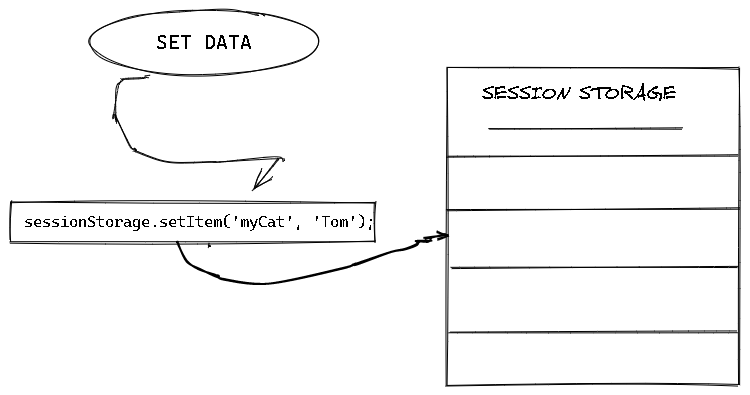
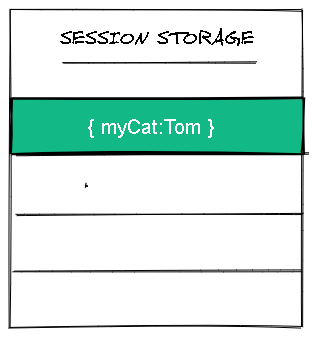
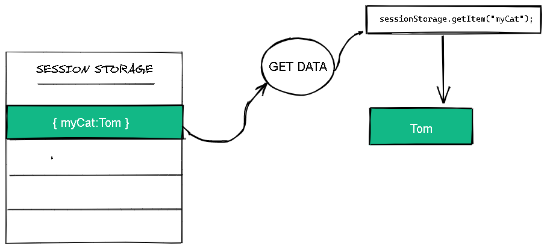

# Say goodbye to local storage

Being an front -end developer one of the common thing that we wanted is to store and share data in the client browser, And most of us really relay on local storage. So what is  **localStorage**..?
according to MDN:
>The `localStorage` provides mechanisms by which browsers can store key/value pairs, in a much more intuitive fashion than using cookies.data stored in  `localStorage`  has no expiration time. Data in a  `localStorage`  object created in a "private browsing" or "incognito" session is cleared when the last "private" tab is closed.

So the data stored in `localStorage`  **is specific to the protocol of the page**. In particular, data stored by a script on a site accessed with HTTP (e.g.,  [http://example.com](http://example.com/)) is put in a different  `localStorage`  object from the same site accessed with HTTPS (e.g.,  [https://example.com](https://example.com/)).

The keys and the values are  _always_  in the UTF-16  [`DOMString`](https://developer.mozilla.org/en-US/docs/Web/API/DOMString)  format, which uses two bytes per character. As with objects, integer keys are automatically converted to strings.


### So what are `localStorage` disadvantages..?

 - data stored in `localStorage` has no expiration time
 - ` localStorage` will be available for any tab or window in the browser,
- Have to constantly keep back up of data to prevent loss
-   The user is completely responsible for the safety of the data
-   Takes up more storage space if you store locally

## Switching to session storage

 `Window.sessionStorage` is a better alternative option for `localStorage`.
 A page session lasts only as long as the browser tab is open, and it will survives over page reloads and restores. But opening a page in a new tab or window will create a new session. And we have storage limit is larger than a cookie (at most 5MB)

## Using Session storage

#### setting data

We can store data using `setItem` method.
syntax :

```js
sessionStorage.setItem('key', 'Value');
```

the above code will add the given key-value pair to session storage.
EG:

so the session storage has one data with key `MyCat`

p


#### Getting data
We can get data using `getItem` method.
syntax :
```js
sessionStorage.getItem("key")
```
the above code will return data of that key from session storage.
EG: 
#### Removing Data
We can get data using `removeItem` or `clear`method.
syntax :
```js
sessionStorage.removeItem("key")
sessionStorage.clear()
```
`removeItem` will remove a specific key from session storage,where as `clear` method will cleanup the entire session storage
