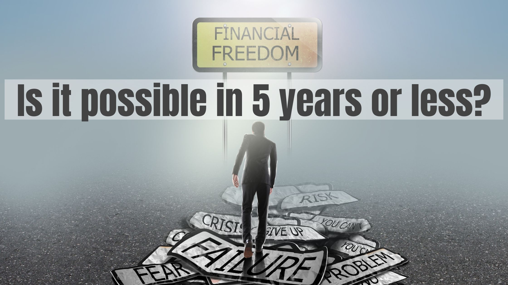
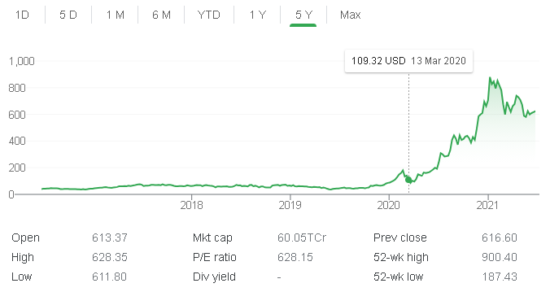
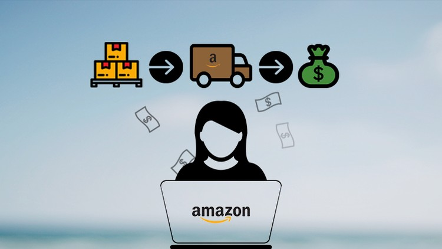
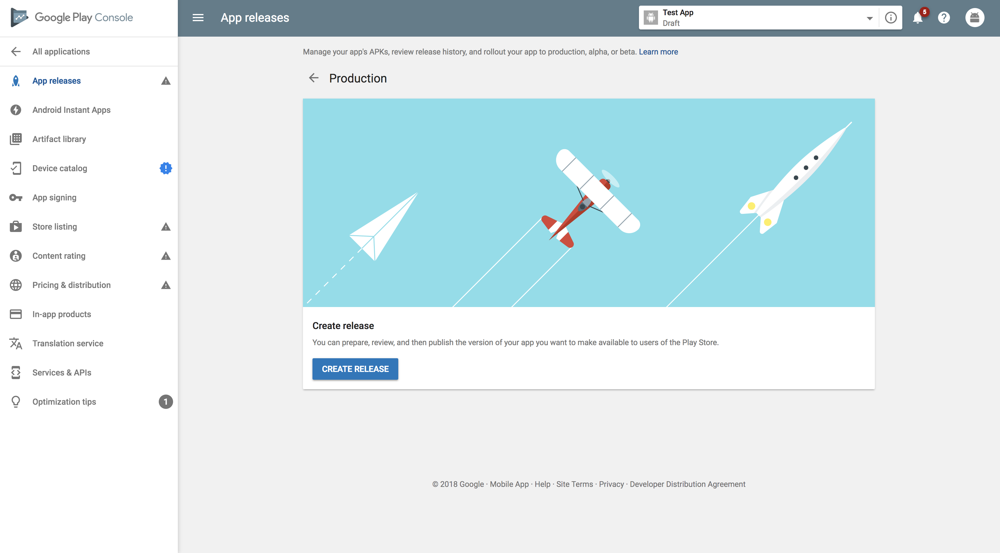

# Sell your skills  and earn more money

one of the main goals in my life is to retire early and enjoy rest by traveling all over the world. I know all of you also have some goals like this. but we know it's hard to save enough money for your retirement life. here am sharing some of my side income techniques, which you can adapt and achieve your financial goals

## share market

If you have invested 1000 dollars on Tesla shares in January 2020   that would be 8800 dollars by January 2021, that means 800% increment in your amount.this itself simply explain the power of share market. I usually make around 60 USD a week, which is much more than enough to cover my family's medical bills. so if you have  1 hour to spend daily,  you can easily make more profit from the share market. most people say it is hard to learn share market concepts but I say actually it's not. it's super easy to learn the foundations which is much more than enough to be an investor. first, start checking youtube videos, find some good shares, start investing

## Sell your skills on amazon

In my home, everyone is super talented except me. my mom really makes good chips, and my sister is good at making crafts from wastes and empty bottles. actually, I was looking for a place to sell their skills and my search landed on amazon. we started an amazon seller account last year and started selling chips and crafts, surprisingly we got good reviews from customers and we are now able to make around 90 USD per month. this was a simple idea that came to my mind on the country-wide lock down in India started on 2020 March, I never thought it would be a success, but it was.

you can sell almost anything on amazon or any other online store. if your son is good at painting start selling his painting, if you are good at farming just start selling some of your agricultural yields. if you are good at gardening even you can sell plant seeds too.

just find out what skills you can sell.. sell it .. and save for future

## A simple app can give you 100 Dollars each month

last year I was planing to make some apps for learning the technologies. I don't want to make something just show on my Github, but I wanted one app that can pay me in the future. at last, I came to an idea to make a simple app that can help people to crack professional exams. I just created a simple app and Deployed it on the play store. surprisingly people started using it, so I just kept updated with new content. later last month I was able to make 100 dollars from my app.

#### "the best time to start was yesterday. the next best time is Now"
Just remember there are plenty of ways that you can achieve your financial goals. all you have to do is just find out one and start doing it. the best time to start was yesterday. the next best time is Now so start now.